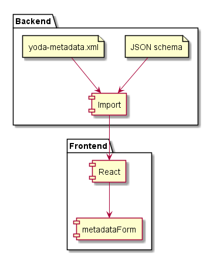
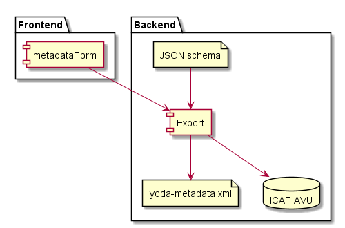
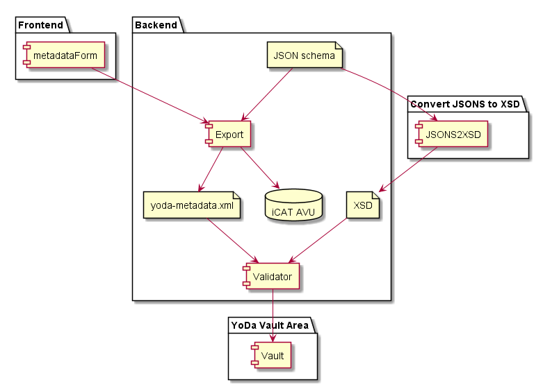

# Metadata form
## Introduction
A Yoda instance holds research information regarding communities (categories).
The type of research data can differ between communities.
Metadata that has to be registered together with research data that can differ as well between communities.  
Yoda supports communities to use their own metadata accompanying their research by giving them the support of a specific metadata form. If no form exists for a specific community then the standard metadata form is used.


*REACT FORM*   
Within YoDa, REACT is the center for metadata form handling. It gives the development team more flexibilty in extending form possibilities.  
YoDa users will experience little change regarding the switch to REACT form. Except maybe for some  gui interface changes.

Yoda metadata is still saved in XML and as such available/accessible for the enduser.

REACT relies on JSON data and JSON validation schema’s.  
That is why internally transformations will have to take place from JSON to XML and vice versa.

Data validation (when submitting metadata for the vault) will still take place based on XSD’s, data transformation is inevitable.

*Change - JSON schema’s*    
The YoDa team will develop JSON schema’s. No longer XSD's.  
The corresponding XSD will be derived from a community JSON by software that converts JSONS schema to XSD.

## Generic implementation
The metadata form handling is implemented in a generic manner. It can be used within several situations/contexts and is used eg. both within the research storage area as well as the vault.

In itself the generic metadata form deals with two situations, i.e.
- an editable form in which users can edit/add metadata to a datapackage
- a readonly view on this metadata as previously entered by a researcher

What the generic metadata form deals with:
- Presenting a form for the metadata of a specific datapackage where the elements on the form are configurable dependent on category
- A default metadata form configuration when no metadata form configuration exists for a category
- Possibility to have dependencies between elements on the form in order to form clear relations between the data
- Determining completeness of the form and giving proper indications to the user dependent on the category a datapackage belongs to
- Determining validity of the metadata form data dependent on the category a datapackage belongs to
- Saving the metadata to a file in XML format within the datapackage (called yoda-metadata.xml)
The file that can be edited via web disk as well by users with sufficient permissions
- When data is saved correctly add the metadata to iCat system as AVU’s to the corresponding datapackage information as well. This so these metadata entries can be searched by users
- Offering possibilities to, after correctly/successfully validating a metadata set, the result can be used for further actions.  Like the ability
  - to bring a datapackage / metadata to the vault from within the dynamic storage environment
  - to save several metadata files, with unique names, within the vault
- readonly view on metadata for a datapackage


# Basic structure

The metadata form is based on React library (https://reactjs.org/)  a javascript library intended for frontend purposes.

This is fitted into the place where the (now obsolete) previous version of metadata handling was situated.  
React replaces the older metadata handling processes completely.


##  Required files and purposes
- React library javascript library.
This forms the generic basis fort he frontend.  
 
- metadata.json - JSON schema  
A JSON file that mainly holds the structural definition of the metadata form as well as mandatoriness.  
This file has been designed for the Yoda implementation and is based on the JSON schema specification (https://json-schema.org/).
The metadata.json file mainly holds all information for the metadata form:  
  1. Declaration of groups of elements
  2. Element names corresponding to the XSD
  3. Element specifics intended for the researcher, like
    - Label of the input element
    - tooltips when hovering over the field
    - Default value when no metadata has been saved yet
  4. Mandatoriness of metadata
  Metadata fields can be configured as being mandatory when requested to be accepted in the vault.
  Special mandatoryness-rules apply for compound fields and subproperty structures.
  This is discusses further in this document.


- vault.XSD  
The vault  XSD is used to validate metadata before it is allowed to be entered in the vault area.  
This XSD is in fact a translation of the corresponding JSON schema.  
To be able to do so, an application JSONS2XSD was created which is described in another design document.

- yoda-metadata.xml  
Holds, in XML format, the metadata as entered by the user.  
This, either after a save action of the user from within the form, or when edited directly when using a WEBdav client.  
The XML data should comply to the corresponding XSD before the metadata can be accepted into the vault.

## Community dependency
Within YoDa, research is supported via groups;  administrative entities declaring which persons are allowed to participate in that perticular research.

Each group within YoDa belongs to a community. A community (=category ) can hold multiple groups.

YoDa is designed in such a way that each community can have its own metadata definition.
If such definition is not present, a YoDa instance is always equipped with a default definition.  
The metadata definition is declared in JSON schema’s.

A metadata definition should always include all information that is required to be able to publish the research datapackage, including its metadata.  
The exact fields can be found on datacite.org

Community dependent files are stored on the virtual iRods drive:

**/tempZone/yoda/schemas**

Each subfolder designates an area that corresponds to a category.

So,
**/tempZone/yoda/schemas/ilab**

holds all the required files for category ilab.

Always, also included is:

**/tempZone/yoda/schemas/default**

Which is the area which holds the default required files where categories do not have its designated category area.

WIthin a category folders following files are located:

- metadata.JSON  
The JSON schema for the category.
- research.XSD  
results from metadata.JSON but without mandatoryness included
- vault.XSD  
results from metadata.JSON but with mandatoryness included


## Complex Data structures

### Subproperty structure
Subproperties designate a structure consisting of
1. one lead element
2. N elements (subproperties) linked to the lead element organised as one group

The lead elemenent can be of every type as mentioned earlier.

#### Implicit mandatoriness
Subproperties cannot exist without the lead information being present.
Saving subproperties that have no lead-data will be deleted when saved.
I.e. the lead information becomes implicitly mandatory when subproperty data exists.

#### Mandatory subproperty within a subproperty structure
A subproperty can be configured as being mandatory.
This rule only applies when lead information is present.

#### Multiplicity/cloning for subproperty structure:
The entire structure can be cloned (if set to multiple within the JSONS).
Subproperties themselves can be cloned if configured in JSONS
Compound fields (see further) can be treated as subproperties and all the above rules will be applicable to these a well (and their own compound properties will be maintained as well)

#### Compound elements
A compound element is an element that consists of several, at least one, related elements.
They are considered to belong together and in that sense treated in that manner.

#### Multiplicity/cloning of compounds
Entire element can be made cloneable – thus cloning the total structure in its entirety

Each individual constructing element within the compound can be made cloneable as well– thus cloning the element within its compound element.

**Implicit mandatoriness when compound is partly filled.**
If one element of a compound is filled, all the others have to be filled as well. These are considered mandatory as well.
Partly filling a compound is not accepted as being valid information

### Compound field as a subproperty

A compound field can be regarded as being a single element. Therefore, it can also be used as a a subproperty.
This is especially useful when the need exists to save the relation of one leading element and a set of information that belongs together.

#### Mandatoriness
Again, if one of the compound elements fields holds data, the other element(s) become mandatory as well. I.e. data cannot be saved when a compound field is not fully filled out.


#### Multiplicity/cloning entire compound
A compound field can be regarded as one element.
Therefore, it can be cloned in its entirety adding one (or more) cloned compounds to the lead element.

#### Multiplicity – cloning element(s) within a compound
As a compound is constructed with normal elements it is possible to add cloning to each or one specific element within a compound element.


### General validation rules for complex structures

Subproperties cannot exist without a lead/main property being present.
I.e. A subproperty structure without lead information is regarded as incomplete information.
As a result the corresponding datapackage will not be accepted for the vault.

* A subproperty can be configured as being mandatory.*

However, this rule is only valid when the corresponding lead element is filled.
In other words, eventhough a mandatory rule exists on a subproperty, the actual subproperty-structure could still be configured as being none-mandatory for the vault.

* Completeness of a compound field*

Compounds are constructed of separate fields but can be regarded as one element.
If one element of a compound field holds a value the other n fields should hold a value as well.

* Completeness of a compound field as a subproperty*
Compound fields within a subproperty structure follow the same rules as on highest level.
I.e. when one element is filled, all elements must be filled.

# Import and export functionality

The import and export functionality establishes the bridge between the newly introduced REACT form, JSON schema based. and the YoDa application XML.

In essence  
-the export functionality transforms the JSON data that was posted by the form into the yoda-metadata.xml conform the Yoda application requirements for the layout of the XML.  
-the import functionality transforms yoda-metadata.xml into JSON that is prepared for handling by he metadata form.


## IMPORT

Purpose:
Build JSON encoded data structure conform the REACT requirements  to ‘feed’ the metadata form as such that YoDa is able to present a metadata form that resembles that original metadataform in functionality as well as gui.




## Export functionality

Purposes:
- Build yoda-metadata.xml based upon the posted output from the REACT form
- Write metadata to iCAT database so it can be searched



There are two steps involved when the researcher submits the data package to the vault

1. save data in yoda-metadata.xml for the datapackage
Based upon the form definition in formelements.xml the posted metadata is matched and saved into yoda-metadata.xml in the corresponding folder.

  - Data that is not 'known', i.e. not defined in formelements.xml is NOT saved.
  - Incomplete subproperty structures are NOT saved in this situation.

  - Data that is sent as empty strings will not be saved.
    This to keep the metadata that is registered in iCat as effective as possible and not be fully drained with empty metadata values

2. save data from yoda-metadata.xml into AVU's for the datapackage
   Writing the metadata-xml file triggers an iRODS-policy to process the content of the file (in XML format), via a stylesheet, into AVU's.
   The stylesheet 'flattens' the hierarchical XML formatted data so all values have an attribute like where all XML tags are places on one line, like:
   *Contributor_Properties_Identifier_Person_Identifier_Scheme
    elaborated with numeric indexes if multiplicity is involved*

Step 2 also occurs when a researcher places a yoda-metadata.xml file on the web disk.

The main definition can be found in JSON Schema definition

**Subproperty structure:**  
In XML a subproperty structure holds a <Properties> tag to separate the leadproperty area in the structure from the subproperty area.  
This designation is not present within the JSON schema representation and has to be added while transforming  the JSON data to XML


** indexed search on metadata **  
Adding values to the iRODS iCAT database, based upon an XSLT, makes search actions possible from the portal within the metadata.


## Submit to vault
When requesting a datapackage to be accepted into the vault, its corresponding metadata will be validated first.  
Validation will take place against the community XSD. If this does not exists, validation will take place against the default XSD of the YoDa instance.



The XSD is a transformation of the JSON schema's that are maintained by the YoDa development team.   
The Yoda team wrote a program to be able to do so. 
The documentation of this conversion tool can be found here:


### Processing of posted metadata in the vault workspace by the datamanager
The metadata form is also used for editing of metadata when the data package has already been accepted and copied to the vault.

A datamanager, a yoda-user that is member of a datamanager-group for the same research-group, can still edit metadata for the package that is already in the vault.
However, the data as originally entered by the researcher and accepted for the vault by a datamanager is never compromised / lost.

The presented metadata form within the vault uses the same technique as in the dynamic storage space.  
Difference is that the newly added data is not actually overwriting the data in yoda-metadata.xml.  
The metadata form saves ithe older data in the vault in the corresponding folder but always with a unique name, based upon timestamps.  
Thus safeguarding earlier or original metadata.

## Example of complex structure including representation of multiple lead/subproperty structure and mutliple compound being part of the subproperties  

CONTRIBUTOR field  

Internal PHP representation of contributor field as read from JSON schema.  
The import and export functionality within the portal software use this structure to be able to determine 

```
 [type] = array
 [items]
      [type] => object – JSON form way of saying a nested structure is present
      [yoda:structure] => subproperties   - YODA way of indicating which type of nested structure
      [properties]
              [Name]
                   [$ref] => #/definitions/stringNormal
                   [title] => Contributor to datapackage
               [Contributor_Type]
                      [$ref] => #/definitions/optionsContributorType
                      [title] => Contributor type
               [Affiliation]
                     [type] => array
                     [default]
                           [0] => Utrecht University
                      [items]
                          [$ref] => #/definitions/stringNormal
                          [title] => Affiliation
                          [yoda:required] => 1
                   [Person_Identifier]
                                   [type] = array
                                   [items]
                                              [type] => object
                                               [title] => Person identifier
                                              [yoda:structure] => compound
                                              [properties] => Array
                                                        [Name_Identifier_Scheme] => Array
                                                             [$ref] => #/definitions/optionsNameIdentifierScheme
                                                             [title] => Type
                                                         [Name_Identifier] => Array
                                                               [$ref] => #/definitions/stringNormal
                                                               [title] => Identifier
                                                               [dependencies] => Array
                                                                    [Name_Identifier_Scheme]
                                                                            [0] => Name_Identifier
                                                                      [Name_Identifier] => Array
                                                                            [0] => Name_Identifier_Scheme
```
